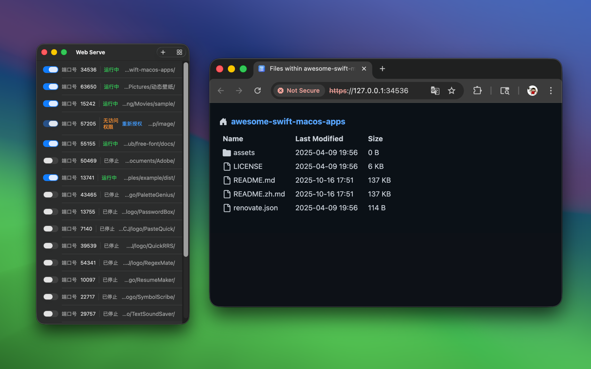

   
   
  
  <h1>Web Serve</h1>
  <!--rehype:style=border: 0;-->
  

    <a href="./README.zh.md">中文</a> • 
    <a target="_blank" href="https://github.com/jaywcjlove/web-serve/issues/new?assignees=&labels=support%2Cfeedback%2Cquestion&projects=&template=bug_report.yml&title=%F0%9F%99%8B%E2%80%8D%E2%99%82%EF%B8%8F+Support+%26+Feedback%3A+Web+Serve">Contact & Support</a>
  

  

    
  

minimum OS requirement: `macOS 14.0`

**"Web Serve"** is a simple and easy-to-use application designed for quickly setting up and managing local static servers, suitable for a variety of use cases. Whether you are a developer, designer, content creator, or a regular user, this application can bring you significant convenience and efficiency.

With "Web Serve" you can easily set up a local static server, allowing you to view, modify, and share static website content locally at any time. Whether it's personal project documentation or collaborative team documents, they can be accessed anytime via the local static server. For front-end developers, this application supports hosting front-end development files, enabling real-time previews and debugging, greatly enhancing development efficiency. Additionally, it supports simulating different domains, helping you effortlessly solve cross-origin request issues and other development challenges.

File transfer and backup are another highlight of "Web Serve." With the help of a local static server, you can easily transfer files between devices within the same local network, which is especially useful when direct connection between devices is not possible. Moreover, as a practical backup tool, you can store important files in specific directories and access and manage them via the static server, ensuring the safety and availability of your data.

For IoT device users, "Web Serve" can serve as a file server for hosting firmware, configuration files, or logs, allowing devices to access and update these files within the local network. Additionally, this application supports data collection, enabling you to store data from multiple IoT devices locally for further analysis.

For users who need offline access to resources, "Web Serve" can host local PDFs, eBooks, video tutorials, and other materials, allowing you to access them anytime, anywhere through the local server, particularly in environments without internet connectivity.

<!--idoc:config:
site: Web Serve
title: Web Serve is a simple and easy-to-use application designed for quickly setting up and managing local static servers, suitable for a variety of use cases - 
keywords: Local Static Server,serve,http-server,Application,Quick Setup,Server Management,Front-End Development,Real-Time Preview,File Transfer,Data Backup,IoT Devices,Offline Access,Development Efficiency,Cross-Origin Requests,Static Website,Local Sharing,Document Hosting
-->