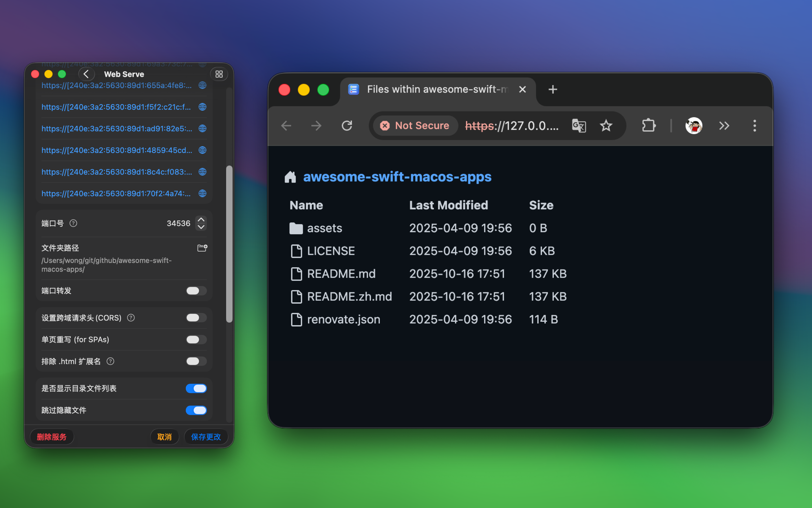

   
   
  
  <h1>Web Serve</h1>
  <!--rehype:style=border: 0;-->
  

    <a href="./README.md">English</a> • 
    <a target="_blank" href="https://github.com/jaywcjlove/web-serve/issues/new?template=bug_report_cn.yml">联系&支持</a>
  

  

    
  

最低操作系统要求：`macOS 14.0`

「Web Serve」是一款简单易用的应用，专为快速搭建和管理本地静态服务器而设计，适用于各种使用场景。无论你是开发者、设计师、内容创作者，还是普通用户，这款应用都能为你带来极大的便利和效率提升。

通过「Web Serve」你可以轻松搭建本地静态服务器，随时查看、修改并本地分享静态网站内容。不论是个人项目文档还是团队协作文档，都可以通过本地静态服务器随时访问。对于前端开发者来说，这款应用支持托管前端开发文件，进行实时预览和调试，大大提高开发效率。同时，它还支持模拟不同的域，帮助你轻松解决跨域请求等开发中的难题。

文件传输和备份是「Web Serve」的另一大功能亮点。借助本地静态服务器，你可以在同一局域网内的设备之间轻松传输文件，特别适合设备间无法直接连接的情况。此外，作为一款实用的备份工具，你可以将重要文件存放在特定目录，并通过静态服务器进行访问和管理，确保数据的安全性和可用性。

对于物联网设备用户，「Web Serve」可以作为文件服务器，用于托管固件、配置文件或日志，方便设备在本地网络中进行访问和更新。此外，这款应用还支持数据收集，将来自多个 IoT 设备的数据存储在本地，便于后续分析。

对于需要离线访问资料的用户，「Web Serve」能够托管本地的 PDF、电子书、视频教程等资料，让你随时随地通过本地服务器进行访问，特别适合在无互联网连接的环境中使用。

<!--idoc:config:
title: 「Web Serve」是一款简单易用的应用，专为快速搭建和管理本地静态服务器而设计，适用于各种使用场景。无论你是开发者、设计师、内容创作者，还是普通用户，这款应用都能为你带来极大的便利和效率提升。 - 
keywords: 本地静态服务器,serve,http-server,应用程序,快速搭建,管理服务器,前端开发,实时预览,文件传输,数据备份,物联网设备,离线访问,开发效率,跨域请求,静态网站,本地分享,文档托管
-->